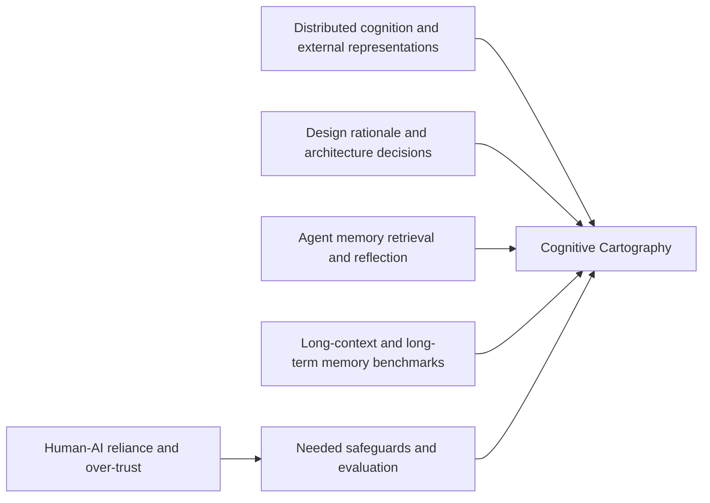

# Deep Research on the Cognitive Cartography Draft

## Executive summary

The draft you supplied is strongest as a **synthetic, cross-disciplinary position paper**: it fuses distributed cognition, external representations, cognitive offloading, architecture-decision documentation, and recent agent-memory work into one practical methodology for sustained human–AI collaboration. The literature strongly supports the draft’s **core intuition** that durable external state, explicit memory structures, reflective revision loops, and retrieval from structured artefacts are important for long-horizon work. In particular, foundational cognitive-science work shows that cognition is distributed across people and artefacts, and that external representations materially change what reasoning is possible; software-architecture research shows that making decisions and rationale explicit reduces “knowledge vaporization”; and recent LLM-agent work repeatedly finds that memory, retrieval, reflection, and structured external state improve multi-step or multi-session performance. citeturn26search0turn3search0turn23search0turn24search0turn28search0turn27search0turn11search0turn21view8turn21view7turn22view0turn21view6turn20view0turn20view1

The draft is weakest in three places. First, the central thesis is currently stated **too categorically**: recent work does show that model-side interventions such as positional-bias calibration, decompositional training, and more deliberate reasoning can materially improve long-context performance, so the claim that larger models or model changes merely “postpone” failure is too strong as written. Second, the paper relies too heavily on **anecdotal evidence and practitioner precedent** for something framed as a general methodology; one worked example is suggestive but not probative. Third, several of its most load-bearing software-engineering anchors are not yet cited with the strongest academic sources available, and the draft under-engages with the literature on **adoption difficulty, over-trust, and interactional risk**. citeturn0search2turn0search4turn0search3turn16search2turn3search4turn2search0turn2search7turn21view1turn21view2

The most important revision is therefore not to retreat from the main idea, but to **reframe and operationalise it**. The paper should claim that, for multi-session, high-dependency, high-change projects, substrate quality is an **independent causal factor** in collaboration quality, and that current evidence suggests model capability alone is insufficient. Then it should define measurable constructs such as *phantom decisions*, *restart cost*, *reference rot*, *decision/consideration confusion*, and *intent fidelity*, and propose or run at least one controlled evaluation comparing flat chat, long-context-only, RAG-only, and full cartographic discipline. That would convert the paper from an insightful manifesto into a credible methodology paper. citeturn0search0turn16search0turn20view1turn20view0turn11search0turn21view8turn21view7turn20view1

In current form, I would classify the draft as **promising and original in framing**, **credible in its synthesis**, but **not yet publication-ready in a research venue** without sharper positioning, stronger academic anchoring, and an empirical evaluation package.

## What the draft currently contributes

Based on the manuscript you provided, the paper argues that long-horizon human–AI collaboration fails less because models are weak in the abstract and more because collaboration lacks a disciplined **external substrate**: explicit, durable, hierarchically organised artefacts that survive across sessions. It proposes six artefact types, a lifecycle, stable identifiers, an edit protocol, propagation rules across abstraction layers, and a session handoff/warm-up discipline. The concept is presented not as a new cognitive phenomenon, but as a newly explicit *meta-methodology* for working with memory-limited AI systems.

That framing is academically defensible because it sits at the intersection of several already-established literatures rather than relying on a single speculative claim. The draft’s real contribution is therefore not a new component analogous to RAG, reflection, or architectural decision records; it is the **integrative claim** that these should be understood as parts of one higher-order discipline of substrate management. That is a legitimate contribution if the paper presents itself clearly as a **synthesis and operational framework** rather than as a fully validated theory. The literature supports that positioning. citeturn26search0turn3search0turn23search0turn24search0turn28search0turn27search0turn22view0turn21view6

A useful way to position the paper is this:

The diagram reflects the current evidence base: foundations come from distributed cognition and representational analysis; operational discipline comes from architecture-decision and rationale literatures; contemporary motivation comes from LLM memory/retrieval/reflection systems; validation pressure comes from long-context benchmarks; and risk mitigation comes from reliance and truthfulness studies. citeturn26search0turn3search0turn23search0turn24search0turn28search0turn27search0turn22view0turn21view8turn21view7turn20view1turn20view0turn21view1turn21view2

The term **“Cognitive Cartography”** itself appears to be a useful originality asset: in the literature I reviewed, I did not encounter a prior canonical academic usage naming this exact combination of substrate discipline, cross-session human–AI coordination, and hierarchical artefact management. That helps the paper. But it also raises the burden of careful “related work” positioning so reviewers do not read the paper as renaming existing ideas without acknowledging them.

## Literature landscape and comparative table

The relevant literature clusters into five strands. The first is **cognitive science / HCI**, where the main story is that reasoning is often distributed across internal and external representations, and that offloading to the environment changes cognitive load and performance. The second is **software architecture and design rationale**, where the central concern is preserving why decisions were made, not merely what the current artefact looks like. The third is **LLM agent architecture**, where retrieval, reflection, memory buffers, and explicit external state are repeated solutions to long-horizon failure modes. The fourth is **evaluation**, where long-context and multi-session benchmarks show that these problems are real and persistent. The fifth is **human–AI interaction risk**, where over-trust and interactional framing complicate any methodology that assumes users can reliably detect model error. citeturn26search0turn3search0turn23search0turn24search0turn28search0turn27search0turn22view0turn21view8turn21view7turn20view0turn20view1turn21view1turn21view2

### Key papers compared

| Authors and year | Methods | Datasets / empirical setting | Main finding | Draft relation | Relevance |
|---|---|---|---|---|---|
| Hutchins 1995 citeturn26search0 | Cognitive ethnography / theory | Ship navigation as distributed system | Cognition is not confined to heads; artefacts and teams can form cognitive systems | Strong support for substrate framing | 5 |
| Zhang & Norman 1994 citeturn3search0 | Representational analysis + experiments | Tower of Hanoi and distributed-task experiments | Internal and external representations jointly determine task performance | Strong support for artefact-level reasoning claims | 5 |
| Scaife & Rogers 1996 citeturn23search0 | Theoretical critique and synthesis | Graphical representations literature | External representations are not mere memory aids; their form shapes cognition | Strong support for glossary/diagram/artefact logic | 4.5 |
| Risko & Gilbert 2016 citeturn24search0turn24search4 | Review | Cognitive offloading studies | People offload cognition when demands rise; offloading changes performance and effort | Strong support, especially for restart-cost and warm-up claims | 4.5 |
| Jansen & Bosch 2005 citeturn28search0 | Conceptual model for software architecture | Architecture decision modelling | Making design decisions explicit reduces “knowledge vaporization” | Very strong support for ADR-like claims | 5 |
| Tang et al. 2006 citeturn21view3 | Practitioner survey | 81 practitioners in architecture design rationale | Designers value rationale, but empirical evidence and systematic practice were limited | Supportive, but also a warning about adoption | 4.5 |
| van Heesch et al. 2012 citeturn27search0 | Framework + industrial case study | Architecture decision documentation case study | Decision views can be documented with reasonable effort, but stakeholder concerns differ | Supportive for structured decision views | 4 |
| Lewis et al. 2020 citeturn0search6 | Retrieval-augmented generation | Knowledge-intensive NLP tasks | External retrieval improves grounding when parametric memory is insufficient | Supportive but partial: retrieval ≠ coherent substrate | 4.5 |
| ReAct 2023 citeturn9search0turn21view8 | Reasoning + acting loop | HotpotQA, FEVER, ALFWorld, WebShop | Interleaving reasoning and external action improves performance and interpretability | Supportive extension | 4 |
| Reflexion 2023 citeturn9search2turn21view7 | Verbal feedback / episodic memory | Coding and sequential decision tasks | Reflective textual memory improves later performance | Supportive extension for edit protocol / reflection | 4 |
| Park et al. 2023 citeturn22view0 | LLM-agent architecture + ablations | 25-agent sandbox simulation | Memory, reflection, and planning all materially contribute to coherent long-run behaviour | Strong support for structured memory + reflection | 4.5 |
| Packer et al. 2024 citeturn15search6turn21view6 | OS-inspired memory architecture | Perpetual chat and long document analysis | Virtual memory / hierarchical context management can make bounded models act over unbounded contexts | Strong support for “substrate matters” | 5 |
| Liu et al. 2024 citeturn0search0 | Long-context evaluation | Multi-document QA and key-value retrieval | Performance is highest at beginning/end and drops in the middle of long contexts | Strong support for long-context fragility | 5 |
| Bai et al. 2024 citeturn16search0 | Benchmark construction | 21-dataset bilingual long-context benchmark | Even strong models still struggle on long contexts; retrieval/compression help but do not close the gap | Supportive | 4.5 |
| Maharana et al. 2024 citeturn20view1 | Dataset + benchmark | LoCoMo: 600-turn, up to 32-session dialogues | Long-context and RAG help, but models still lag humans on very long-term dialogue memory | Strong support | 5 |
| Wu et al. 2025 citeturn20view0 | Benchmark + memory design study | LongMemEval | Existing systems show a ~30% drop across sustained interactions; memory-design optimisations help | Strong support and evaluation template | 5 |
| Ge et al. 2025 citeturn7search0 | Benchmark + neuro-symbolic memory reasoning | Multi-session temporal reasoning over LoCoMo-derived dialogues | Timeline summarisation plus temporal reasoning sharply improves multi-session performance | Supportive extension | 4 |
| Hsieh et al. 2024 citeturn0search2 | Calibration of attention bias | Long-context retrieval and RAG tasks | Model-side calibration improves utilisation of mid-context information and boosts RAG | Critical challenge to overly substrate-only claims | 4.5 |
| He et al. 2024 citeturn0search4 | Position-agnostic decompositional training | Multi-doc QA and retrieval | Training can substantially mitigate lost-in-the-middle | Critical challenge | 4 |
| Yu et al. 2025 citeturn0search3 | Long-context retrieval evaluation | Hard retrieval tasks | Some long-context failures depend on insufficient reasoning steps, not just memory access | Critical challenge | 4 |
| Star 2010 citeturn2search0 | Conceptual reflection | Boundary-objects literature | Boundary objects are often oversimplified and are not universally useful at any scale | Critical caution for one of the draft’s core metaphors | 4 |

The table suggests a clear verdict. The draft is standing on **real intellectual ground**. But the literature also shows that the paper must be more precise about what is a **substrate problem**, what is a **reasoning-protocol problem**, and what is a **model/training problem**. Right now those categories are rhetorically separated more sharply in the draft than the evidence warrants. citeturn0search0turn0search2turn0search3turn0search4turn20view0turn20view1

## Supportive, critical, and neutral findings

### Supportive and extending work

The most supportive foundational work comes from distributed-cognition, representational-analysis, and cognitive-offloading traditions. Hutchins’ account of navigation treats teams and artefacts as a cognitive system; Zhang and Norman show that the structure of external representations changes problem-solving behaviour; Scaife and Rogers argue that external representations are not just storage but active components of reasoning; and Risko and Gilbert review the empirical case that people routinely use the environment to reduce cognitive demand. Together, these papers justify the paper’s underlying move from “memory-in-the-head” to “work distributed across agents and artefacts.” citeturn26search0turn3search0turn23search0turn24search0turn24search4

The closest software-engineering analogues come from architecture-decision and rationale literatures. Jansen and Bosch explicitly frame architecture as a set of design decisions and diagnose “knowledge vaporization” as a problem caused by decisions not being first-class objects. Tang et al. show practitioners value rationale, while van Heesch et al. provide a more formal documentation framework based on architecture viewpoints. These are especially important for your draft because they let you replace or supplement practitioner-only sources with peer-reviewed precedent. They also make clear that your proposal is not merely “good note-taking”; it is a **decision-centric knowledge-management discipline**. citeturn28search0turn21view3turn27search0turn27search1turn27search2

The strongest contemporary supports come from agent-memory work. RAG demonstrates that external retrieval can improve knowledge-intensive tasks when parameters are insufficient; ReAct shows that reasoning plus action beats static prompting; Reflexion demonstrates gains from reflective textual memory; Generative Agents show that memory, reflection, and planning all matter for coherence over time; and MemGPT operationalises the idea of hierarchical memory for bounded-context models. These works do not prove your full methodology, but they do strongly support the paper’s claim that explicit external state and structured memory procedures are central, not incidental, to long-horizon LLM work. citeturn0search6turn11search0turn9search0turn21view8turn9search2turn21view7turn22view0turn21view6

Finally, the benchmark literature supports the draft’s diagnosis that current systems remain poor at long-term coherence. Lost in the Middle finds strong positional weaknesses in long-context use; LongBench finds broad long-context struggles even in strong models; LoCoMo shows that long-context and RAG help but still leave large gaps to humans in very long-term dialogue memory; and LongMemEval reports sizeable accuracy drops across sustained interactions while also showing that memory design choices matter. This is probably the single most important empirical cluster for your paper because it demonstrates that the problem your methodology addresses is genuine and not merely anecdotal. citeturn0search0turn16search0turn20view1turn20view0

### Contradictory and critical work

The draft currently says, in effect, that larger context windows and larger models do not solve the underlying problem. The literature partly agrees, but not without qualification. Hsieh et al. show that positional-attention calibration can reduce lost-in-the-middle and improve downstream RAG; He et al. show that decompositional, position-agnostic training can materially improve long-context QA and retrieval; and Yu et al. show that some long-context failures are better understood as failures to perform enough reasoning steps rather than simple memory-access failure. Those papers do not refute your thesis, but they **do refute a strong version of it**. A reviewer could reasonably object that the draft over-attributes failures to substrate and under-attributes them to trainable model behaviour. citeturn0search2turn0search4turn0search3

The draft also uses “boundary objects” as a supportive theoretical metaphor. That connection is plausible, but Star’s later reflection is directly relevant: she warns that boundary objects are often deployed too loosely and are not useful “at just any level of scale” absent the full underlying model. Kertcher and Coslor similarly show that creating stable boundary objects across divergent technical cultures is itself difficult. These are not deal-breakers, but they mean your paper should avoid treating the boundary-object concept as a simple universal endorsement. citeturn2search0turn2search7

A second underdeveloped risk concerns **practice and adoption**. The software-architecture-knowledge-management review notes that many AKM approaches had not found widespread use in practice, despite substantial literature and tooling work. That is directly relevant to your claim that the method is “practicable today by anyone with no special tooling.” It may be practicable in principle, but the adoption literature suggests that disciplined knowledge practices often fail not because they are conceptually weak, but because they are costly, brittle, under-tooled, or socially hard to maintain. citeturn3search4turn21view3

A third risk the draft presently underplays is **over-trust**. REL-A.I. shows that reliance on LLM outputs depends on interactional framing and prior context, not just truthfulness or calibration. Si et al. show that LLM explanations can help users verify claims, but users over-rely when the explanation is wrong. For your draft, this means that a disciplined substrate alone is not enough: the system must also support **abstention, provenance visibility, and contradiction signalling**, otherwise a neat substrate can simply preserve or amplify plausible errors. citeturn21view1turn21view2

### Neutral and contextual work

Some papers are less direct supports than useful context. Constitutional AI is relevant because it exemplifies rule-governed, explicit normative guidance outside any single response, but it is aimed at harmlessness and oversight rather than cross-session project memory. IRCoT is relevant because it shows retrieval can be interleaved with reasoning, but its focus is multi-step knowledge-intensive QA rather than durable project state. Agency and human-agent collaboration papers are useful because they remind you that collaboration quality depends on when and how humans intervene, not just on memory structure. These papers are worth citing for framing, but they should not be presented as direct evidence for the paper’s central methodological claims. citeturn13search2turn11search0turn21view0turn18search4

## Risks, gaps, and a concrete revision programme

The draft’s main methodological risk is **construct ambiguity**. Terms such as *substrate*, *intent fidelity*, *phantom decisions*, *reference rot*, and *decided versus considered confusion* are intuitively strong, but they are not yet defined as research constructs that another lab could operationalise. Without operationalisation, reviewers can only treat them as clever language. To fix this, add a short section that defines each construct, gives an observable signature, and states how it would be measured. For example: phantom decision rate = proportion of answers to “did we decide X?” that confidently infer a decision absent any identified authoritative artefact; restart cost = median time or token budget required to resume productive work after a session gap; reference rot = percentage of references that no longer resolve to a unique authoritative artefact after a reorganisation. Those measures align directly with the benchmark and memory literature. citeturn20view0turn20view1turn0search0

The second risk is **overclaiming**. The current strongest sentence in the argument is effectively “these limits will not be dissolved by larger models.” That is too absolute given the calibration, training, and reasoning literature. A safer formulation would be: *For multi-session, high-coupling projects, model scaling alone has not yet eliminated long-horizon failure modes; substrate discipline remains an independent and under-practised determinant of collaboration quality.* That phrasing is still strong, still original, and much harder to attack. citeturn0search2turn0search4turn0search3turn20view1turn20view0

The third risk is **source quality and imbalance**. The AI-related citations are better than the software-engineering grounding: notable load-bearing claims currently lean on online or practitioner sources where stronger peer-reviewed substitutes exist. Replace or supplement those with Jansen and Bosch on explicit architecture decisions, Tang et al. on rationale capture in practice, van Heesch et al. on decision documentation frameworks, Tofan et al. on the mapping study of architectural decisions, and Capilla et al. on architecture knowledge management. This one change would significantly improve the paper’s academic posture. citeturn28search0turn21view3turn27search0turn27search2turn3search4

The fourth risk is **insufficient empirical validation**. The worked example in the paper is useful, but it is explicitly acknowledged not to prove the discipline works. That honesty is good; the fix is to add an empirical agenda. The cleanest design is a controlled comparison across at least four conditions: flat chat; long-context-only; RAG over unstructured documents; and full Cognitive Cartography with explicit artefact types and protocols. Use tasks that require cross-session state, dependency tracking, and decision provenance. The literature suggests benchmark templates and task families you can adapt from long-term dialogue memory and multi-step retrieval work. citeturn20view1turn20view0turn11search0turn16search0

The fifth risk is **human reliability and over-trust**. Because users can over-rely on polished explanations, the methodology should include explicit safeguards. I would add one short subsection to the protocol defining three mandatory moves for high-stakes edits: identify the authoritative artefact by stable identifier, quote or link the exact status-bearing field, and flag uncertainty when no authoritative artefact exists. That turns the protocol from a coordination method into a provenance method. It also directly addresses evidence from reliance studies. citeturn21view1turn21view2

### Recommended empirical package

| Experiment | Design | Primary metrics | Why it matters |
|---|---|---|---|
| Controlled cross-session study | Human–LLM pairs solve the same project across multiple sessions under flat-chat, long-context-only, RAG-only, and full-cartography conditions | Decision recall accuracy, phantom-decision rate, contradiction rate, resume time, task completion quality | Directly tests the central thesis |
| Ablation study | Full method versus ADR-only, glossary-only, SSOT-only, warm-up/handoff-only | Which protocol components carry most of the gain | Prevents the method from looking over-engineered |
| Offline replay benchmark | Seed a synthetic project archive with requirements, decisions, open questions, and changes; replay standardised evaluation prompts | Provenance resolution, impact-trace accuracy, stale-reference detection | Makes the method measurable and reproducible |
| Field deployment | Small team uses the method over several weeks on a real project | Adoption cost, edit overhead, artefact freshness, user-reported trust and burden | Tests practicability and social viability |

The core point is that the methodology becomes far more persuasive if it is tested not only for **output quality**, but for **coordination quality**: can collaborators recover state, explain why something changed, and avoid silently resurrecting rejected options? That is where the draft is most distinctive, and current benchmarks give you good scaffolding for constructing such evaluations. citeturn20view1turn20view0turn7search0

## Annotated bibliography and prioritised reading

### Annotated bibliography

**Hutchins, 1995, *Cognition in the Wild*.**  
**Classification:** Supportive / foundational.  
**Methods:** Cognitive ethnography of navigation as a socio-technical system.  
**Results:** The cognitive system includes people, instruments, conventions, and representations, not only individual minds.  
**Strengths:** This is probably the strongest high-level intellectual foundation for the paper’s substrate argument.  
**Limitations:** It is not about LLMs, and it does not directly validate a documentation protocol.  
**Use in your draft:** Add it as the opening theoretical anchor, but avoid implying it directly proves your specific artefact taxonomy. citeturn26search0

**Zhang and Norman, 1994, “Representations in distributed cognitive tasks.”**  
**Classification:** Supportive / foundational.  
**Methods:** Representational analysis plus experiments on distributed cognitive tasks.  
**Results:** Internal and external representations jointly shape task behaviour; the structure of the representation matters.  
**Strengths:** This gives you a precise way to justify why the *form* of artefacts matters, not just their existence.  
**Limitations:** The tasks are stylised and far from real knowledge work.  
**Use in your draft:** Cite this where you discuss hierarchical artefacts, inventories, and dictionaries as notational choices that change reasoning. citeturn3search0

**Scaife and Rogers, 1996, “External cognition: how do graphical representations work?”**  
**Classification:** Supportive / theoretical extension.  
**Methods:** Critical synthesis of graphical-representation research.  
**Results:** External representations have cognitive value beyond mere storage and demand analysis in relation to internal representations.  
**Strengths:** Excellent for justifying the draft’s insistence on maps, glossaries, and structured artefacts.  
**Limitations:** Broader and more design-oriented than your protocol itself.  
**Use in your draft:** Strong replacement for part of the current intuitive argument about why maps matter. citeturn23search0

**Risko and Gilbert, 2016, “Cognitive Offloading.”**  
**Classification:** Supportive / foundational.  
**Methods:** Review of cognitive-offloading work.  
**Results:** People externalise memory and task demands when costs rise; offloading changes both effort and performance.  
**Strengths:** Direct support for restart-cost, session warm-up, and external reminders.  
**Limitations:** Also warns that offloading can be suboptimal when metacognition is wrong.  
**Use in your draft:** Useful both as support and as a caution against assuming all offloading is automatically beneficial. citeturn24search0turn24search4

**Jansen and Bosch, 2005, “Software Architecture as a Set of Architectural Design Decisions.”**  
**Classification:** Supportive / directly adjacent.  
**Methods:** Conceptual architecture model.  
**Results:** Explicit architectural decisions reduce “knowledge vaporization.”  
**Strengths:** This is one of the closest academic analogues to your ADR and decision-provenance claims.  
**Limitations:** Narrowly software-architectural and not about human–AI collaboration.  
**Use in your draft:** Replace the current over-reliance on practitioner ADR sources by putting this near the centre of the software-engineering related-work section. citeturn28search0

**Tang et al., 2006, “A survey of architecture design rationale.”**  
**Classification:** Supportive with caution.  
**Methods:** Practitioner survey.  
**Results:** Practitioners regard design rationale as important, but evidence and practice were uneven.  
**Strengths:** Gives empirical grounding to the intuition that undocumented rationale is costly.  
**Limitations:** Older and architecture-specific.  
**Use in your draft:** Use to justify the need for disciplined rationale capture, then connect to your broader substrate framework. citeturn21view3

**van Heesch et al., 2012, “A documentation framework for architecture decisions.”**  
**Classification:** Supportive / structural extension.  
**Methods:** Documentation framework plus case study.  
**Results:** Decision views can be created with reasonable effort and satisfy stakeholder concerns, but no single decision representation covers everything.  
**Strengths:** Important for your argument that structure matters and that different stakeholders need different views.  
**Limitations:** Also implies your “small fixed taxonomy” needs justification.  
**Use in your draft:** Good support for comparing your six artefact classes with existing decision-view approaches. citeturn27search0

**Lewis et al., 2020, “Retrieval-Augmented Generation for Knowledge-Intensive NLP Tasks.”**  
**Classification:** Supportive / contemporary precursor.  
**Methods:** Retrieval plus sequence generation.  
**Results:** External retrieval improves knowledge-intensive NLP tasks.  
**Strengths:** Essential for your claim that external state matters.  
**Limitations:** RAG addresses retrieval, not long-lived coherence or state maintenance.  
**Use in your draft:** Be explicit that RAG is necessary but insufficient for your problem. citeturn0search6

**Yao et al., 2023, “ReAct.”**  
**Classification:** Supportive / extension.  
**Methods:** Interleaving reasoning and action.  
**Results:** Better performance and interpretability than static prompting baselines.  
**Strengths:** Strong evidence that interaction with external systems and explicit reasoning traces matter.  
**Limitations:** Not a document-substrate methodology per se.  
**Use in your draft:** Position as a complementary protocol-level intervention rather than as evidence for your full discipline. citeturn9search0turn21view8

**Shinn et al., 2023, “Reflexion.”**  
**Classification:** Supportive / extension.  
**Methods:** Verbal reinforcement with reflective memory.  
**Results:** Reflective language buffers improve sequential agent performance.  
**Strengths:** Directly relevant to your edit protocol and handoff logic.  
**Limitations:** Reflection here is episodic textual memory, not a full substrate graph.  
**Use in your draft:** Good support for mandatory pre-edit reflection and post-action learning trails. citeturn9search2turn21view7

**Park et al., 2023, “Generative Agents.”**  
**Classification:** Supportive / extension.  
**Methods:** Memory, reflection, and planning architecture in a sandbox society.  
**Results:** Reflection and memory retrieval materially affect long-run coherence and believable behaviour.  
**Strengths:** One of the clearest demonstrations that “agent coherence over time” requires memory infrastructure.  
**Limitations:** The environment is simulated and socially stylised.  
**Use in your draft:** Cite as evidence that memory, reflection, and planning form a recurrent pattern in long-running LLM systems. citeturn22view0

**Packer et al., 2024, “MemGPT.”**  
**Classification:** Supportive / directly adjacent.  
**Methods:** Hierarchical virtual-context management inspired by operating systems.  
**Results:** Bounded-context models can better handle perpetual chat and long document analysis via structured memory management.  
**Strengths:** Very close to your “substrate matters” thesis and to your operating-system metaphor.  
**Limitations:** It is still largely a systems paper, not a human-work methodology.  
**Use in your draft:** Keep it, but explicitly distinguish automated memory management from practitioner-managed cognitive cartography. citeturn15search6turn21view6

**Liu et al., 2024, “Lost in the Middle.”**  
**Classification:** Supportive / empirical problem evidence.  
**Methods:** Long-context evaluation.  
**Results:** Retrieval accuracy degrades strongly when relevant information is in the middle of context windows.  
**Strengths:** Excellent direct evidence for one of your named failure modes.  
**Limitations:** It is not itself a study of multi-session project work.  
**Use in your draft:** One of your strongest empirical citations. citeturn0search0

**Maharana et al., 2024, “Evaluating Very Long-Term Conversational Memory of LLM Agents.”**  
**Classification:** Supportive / empirical problem evidence.  
**Methods:** Dataset and benchmark construction.  
**Results:** Very long-term dialogue remains difficult; long-context and RAG help but still trail humans.  
**Strengths:** Highly relevant because it mirrors your multi-session setting.  
**Limitations:** Dialogue memory is not identical to project-state governance.  
**Use in your draft:** Use as the most direct empirical motivation for long-horizon collaboration problems. citeturn20view1

**Wu et al., 2025, “LongMemEval.”**  
**Classification:** Supportive / empirical problem evidence.  
**Methods:** Benchmarking and design analysis.  
**Results:** Existing systems drop markedly on long-term interactive memory, while better indexing/retrieval/reading improves performance.  
**Strengths:** Gives you both a benchmark precedent and design knobs to cite.  
**Limitations:** Focuses on assistant memory, not project-document methodology.  
**Use in your draft:** Strong support for turning your proposal into a measurable evaluation. citeturn20view0

**Hsieh et al., 2024, “Found in the Middle.”**  
**Classification:** Contradictory / critical.  
**Methods:** Calibration mechanism for positional attention bias.  
**Results:** Model-side calibration improves mid-context utilisation and downstream RAG.  
**Strengths:** Important corrective to overly strong anti-model claims.  
**Limitations:** Improvement is not the same as eliminating long-horizon collaboration problems.  
**Use in your draft:** Cite in a limitations or scope paragraph to show intellectual honesty. citeturn0search2

**Star, 2010, “This is Not a Boundary Object.”**  
**Classification:** Contradictory / conceptual caution.  
**Methods:** Reflective conceptual critique.  
**Results:** Boundary objects are often oversimplified and are not plug-and-play explanations.  
**Strengths:** Helps you avoid overextending the metaphor.  
**Limitations:** Indirectly related to LLM collaboration.  
**Use in your draft:** Mention briefly to discipline your use of the concept rather than remove it. citeturn2search0

### Prioritised reading list

If you want the shortest reading path that most improves the paper, read in this order:

1. **Jansen and Bosch 2005** — because it gives you the cleanest academic bridge from software architecture to explicit design-decision objects. citeturn28search0  
2. **Liu et al. 2024, Lost in the Middle** — because it gives you hard empirical evidence for long-context fragility. citeturn0search0  
3. **Maharana et al. 2024, LoCoMo** — because it is closest to your multi-session collaboration setting. citeturn20view1  
4. **Wu et al. 2025, LongMemEval** — because it turns “memory over time” into a benchmarkable design problem. citeturn20view0  
5. **Risko and Gilbert 2016** — because it provides the clearest cognitive account of why externalisation helps. citeturn24search0turn24search4  
6. **Zhang and Norman 1994** — because it helps justify why artefact structure matters, not just externalisation in general. citeturn3search0  
7. **Park et al. 2023, Generative Agents** — because it shows memory, reflection, and planning as an interacting package. citeturn22view0  
8. **Hsieh et al. 2024, Found in the Middle** — because it sharpens the paper’s caveats and prevents overclaiming. citeturn0search2  
9. **Tang et al. 2006** — because it supports your decision-rationale case while warning about adoption. citeturn21view3  
10. **REL-A.I. 2025** — because it forces you to think about user reliance and not only substrate design. citeturn21view1

## Next-iteration tasks and open questions

The highest-value next iteration is to revise the paper around a narrower, more defensible claim, stronger academic anchoring, and an explicit empirical plan. The sequence below is the order I would actually follow.

1. **Reframe the thesis.** Replace categorical language such as “will not be dissolved by larger models” with a narrower causal claim about multi-session, high-coupling work. Cite both supportive and critical long-context papers so the claim reads as balanced rather than polemical. citeturn0search0turn0search2turn0search3turn0search4

2. **Rewrite the related-work section into five clusters.** Use the structure from this report: distributed cognition and external representations; design rationale and architectural knowledge; agent memory/retrieval/reflection; long-context and long-term evaluation; human–AI reliance. This will make the contribution look integrative rather than idiosyncratic. citeturn26search0turn3search0turn23search0turn28search0turn27search0turn22view0turn20view0turn20view1turn21view1turn21view2

3. **Upgrade citation quality.** Replace or supplement online/practitioner anchors with peer-reviewed sources on architecture decisions, rationale, and AKM. This is one of the easiest quality improvements available. citeturn28search0turn21view3turn27search0turn27search2turn3search4

4. **Operationalise all named failure modes.** Add a compact table defining each construct, how it manifests, and how it would be measured. This is essential for publication credibility.

5. **Add a comparative-positioning table.** Show how Cognitive Cartography differs from flat chat, RAG, MemGPT-like memory systems, ADR-only practice, and ordinary note-taking. That will make the novelty precise rather than rhetorical. citeturn0search6turn21view6turn28search0

6. **Design at least one empirical study.** Even if you do not run the full study before submission, include a pre-registered or clearly specified evaluation design inspired by LoCoMo and LongMemEval. Reviewers will reward the paper for testability. citeturn20view1turn20view0

7. **Add safeguards for uncertainty and provenance.** Integrate abstention, provenance-first answering, and contradiction checks into the protocol, in light of user-reliance findings. citeturn21view1turn21view2

8. **Clarify scope conditions.** Preserve the existing limits section, but strengthen it with explicit statements about adoption cost, two-or-more-author coordination, and cases where ontology is still emerging. The literature on boundary objects and AKM gives you reason to do this more forcefully. citeturn2search0turn2search7turn3search4

### Open questions and limitations

This review is strongest on **theoretical positioning, adjacent literatures, and evaluation design**. It is weaker on any claim that would require re-analysing empirical results from your own project archive, because the manuscript appears to be a conceptual-methodology draft rather than a paper with a complete experimental appendix. Some practitioner sources in the draft may still be worth keeping as historical or community context, but they should not carry the main evidentiary load. I also did not find a prior canonical academic literature using the exact phrase “Cognitive Cartography” for this method, which supports originality but increases the burden of careful comparison against neighbouring concepts.